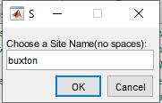
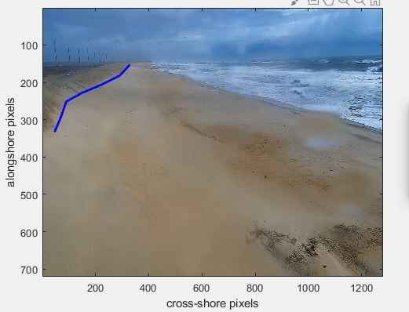
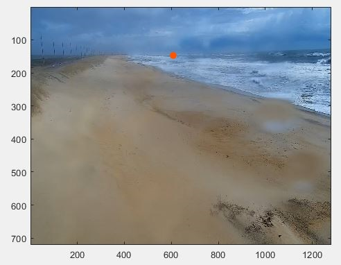
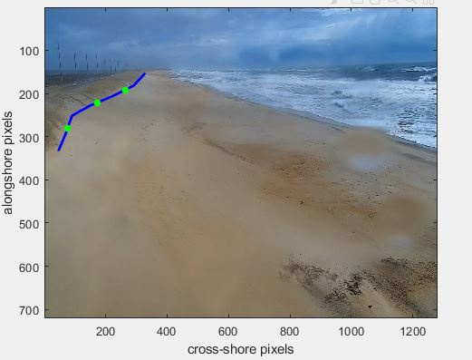

# Detection of Maximum Water Levels To Monitor Dune Collisions 


## What is it?

This algorithm monitors hourly maximum water levels and records the timing, frequency, and duration of dune-impacts caused by elevated shoreline water levels. It uses publically available webcam images/videos, thereby reducing the need for labor intensive camera surveying and image rectification. This algorithm was designed to be accessible to all levels of the community, meaning it only processes and analyzes one webcam video at a time. However, the scripts can be easily modified and used for processing and analyzing a large number of videos. 


## What is Needed to Run the Algorithm?

In order to run the scripts for this project (listed below), MATLAB software and certain toolboxes are required.

### 1. Scripts Needed for this Project

The main script for this project is called 'analyze_dune_collisions'. However, all scripts need to be downloaded in the same directory as this main script calls in the functions associated with the other secondary scripts.

Scripts:
1) analyze_dune_collision 
2) station_setup 
3) get_snapshot
4) choose_locations
5) digitize_Dune 
6) readindexframe
7) get_brightest_timestack 
8) check_brightest
9) check_timestack


### 2. Required MATLAB Toolboxes 

Specific toolboxes within MATLAB need to be enabled for certain functions to work. 

Required Toolboxes:
1) Signal processing toolbox
2) Image processing toolbox
3) Statistics and machine learning toolbox

## Usage: What to do first

1) You will need to download videos from a webcamera. A recommended site for video downloads is SECOORA's WebCAT stations (https://secoora.org/webcat/). Videos can be accessed directly through SECOORA's website, or accessed via a command-line tool like wget or curl.
 
```bash
http://webcat-video.axds.co/<stationcode>/raw/<year>/
<year>_<month>/<year>_<month>_<day>/<stationcode>.
<year>-<month>- <day>_<time>.mp4
```
Example:
```bash
http://webcat-video.axds.co/twinpierscam/raw/2018/
2018_06/2018_06_03/twinpierscam.2018-06-03_1000.mp4
```
2) Once the videos are downloaded, set up a webcamera location using either the "station_setup" script or through the main script called "analyze_dune_collision".

## Setting up a Webcamera Station

Setting up a webcamera station only needs to be done once per webcamera location, unless the view of the camera or the position of the dune changes (e.g., after a storm). Regardless of which script is chosen to set up a station, the steps performed are the same and should take less than 5 minutes to complete:


1) Identify a station name: Users will need to identify a station name that will be used for all videos from this location.
 
2) Digitize a duneline: The user will be prompted to digitize the base of the dune. This will be used to compare to the observed water levels and determine the potential for dune erosion.  DISCLAIMER: if the duneline position changes, a new duneline will need to be digitized for accurate results (e.g., after large storms or events).

3) Interpolation of the digitized duneline: the script will automatically interpolate the digitized duneline. No user input is required. 

4) Crop out horizon: user will need to select one point at the base of the horizon where the snapshot will be cropped to. This aids in the accuracy of the analysis for dune collisions. 

5) Identify 3 locations of interest: User chooses three locations of interest along the dune line. The algorithm will monitor water levels at these locations and determine the potential for dune collisions. The locations could correspond to low points in the dune, areas of exposed infrastructure (e.g., roadways, etc.). Make sure the chosen points represent the area of focus/interest. 

 
 
If the "station_setup" script was used to set up a webcamera station instead of 'analyze_dune_collision', users will then need to run the "analyze_dune_collision" script to obtain the final products.

## Final Products

This algorithm produces a .png image and .mat file. The .png image displays the location of the three identified transects. Each location will either be colored green, yellow, or red. A green dot represents the absence of a dune-collision event at that location during that webcam video. A yellow dot indicates that only one method marked a dune-collision event at that location. A red dot means that a dune-collision event was recorded by both methods at that location during the webcam video (see image below). Individual results from both methods will be provided in the .mat file. 